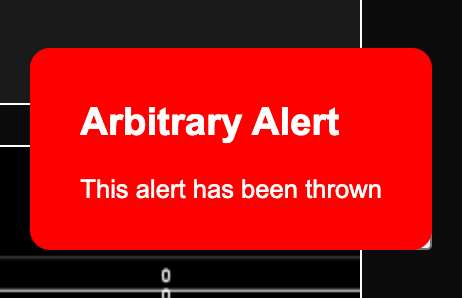
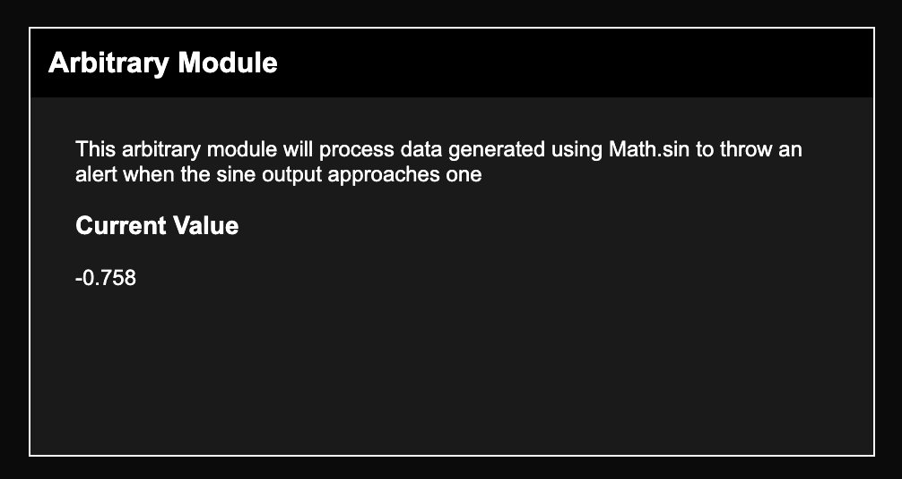

# js-biosensor-modules
[](https://www.gnu.org/licenses/agpl-3.0)
[](https://discord.gg/CDxskSh9ZB)

## Overview
`js-biosensor-modules` is a collection of JavaScript modules for interacting with and visualizing biosensor data. 

### Algorithms
*Coming soon*

### Alerts
1. [Heart Rate](./alerts/heartrate.ts): Detects heart rate from ECG data.
2. [Gyro](./alerts/gyro.ts): Detects fast movements from gyro data.

## The Tech Stack
This repository relies on [graphscript](https://github.com/brainsatplay/graphscript) for module development and [device-decoder](https://github.com/joshbrew/device_debugger) for acquiring biosensor data on web browsers.


## Contributing
If you would like to contribute to this project, [submit an issue](https://github.com/brainsatplay/js-biosensor-modules/issues) to begin a discussion on the best course of action.

### Developing a New Alert
The process of creating a new alert is very simple. All alerts have a **condition** and a **message** that allows you to define its basic behavior.

These can be declared as an **alert configuration file** inside the `alerts` folder:

```js
let refractoryPeriod = 1000
let canTrigger = true

export const message = `<h2>Arbitrary Alert</h2><p>This alert has been thrown</p>`

export const condition = (value) => {

    if (canTrigger){
        const triggered = (1 - value) < 0.05
        if (triggered) {
            canTrigger = false
            setTimeout(() => canTrigger = true, refractoryPeriod)
        }

        return triggered
    } else return false
}

export const bufferLength = 0 // Optional property to maintain a buffer of values

export const preprocess = (buffer) => buffer.reduce((a,b) => a + b, 0) / buffer.length // Optional property to preprocess the buffer before the condition check

```

This will throw an alert when the input approaches one.

After creating your configuration file, you can then load your alert into the `Alert` class:
```js
import * as config from './alerts/arbitrary.js'
import Alert from './alerts/Alert.js'

const alert = new Alert(config)
```

You can then either **check** whether a value meets the specified condition or **throw** the alert manually.
```js
alert.check(0.4) // Alert is not triggered...
alert.check(1) // Alert is triggered!
alert.throw() // Alert is triggered!
```

When thrown, the alert will appear on the UI: 


### Developing a New Algorithm
Algorithms are classes that process data and (optionally) check alerts.

To declare a new algorithm, create a configuration file that extends the `Algorithm` class:
```js
export const operator = (info) => info.value // We assume that the incoming information has a nested value
```

This can then be loaded into the `Algorithm` class along with an alert:
```js
import * as config from './algorithms/arbitrary.js'
import Algorithm from './algorithms/Algorithm.js'

const algorithm = new Algorithm(config)
```

Incoming data can then be processed using the `apply` function:
```js
const under = algorithm.apply(0.4) 
alert.check(under) // Alert is not triggered...

const over = algorithm.apply(1)
alert.check(over) // Alert is triggered!

```

#### Subscribing to a Data Stream
To hook an algorithm into one of the real-time data streams managed by this application, add a subscription function to the `tree.alerts.__listeners` object in `tree.ts` (or edit one of the existing subscriptions...):

```js
// ...
    alerts: {
        __element:'div',
        __listeners: {
            'state.ppg': // ...
            'state.imu': // ...
            'state.arbitrary': (data) => {
                const res = algorithm.apply(data)
                alert.check(res)
            }
        }
    },
// ...

```

### Developing a MyAlyce Module
Modules may have both an alert and an algorithm. This integrates their behavior to automate the process of alerting the user when a condition is met after processing the data:

```js
import Module from './components/Module'
const module = new Module({
    alert,
    algorithm
})

module.__operator(1) // Alert is triggered!

```

Subscriptions can be defined using shorthand notation: 

```js
const module = new Module({
    /// ...
    subscriptions: [ 'states.arbitrary' ]
})
```

You many also add a UI to the module in standard GraphScript format. Direct children may hook into the algorithm output using the `__operator` keyword: 
```js
const module = new Module({
    /// ...
    name: 'Arbitrary Module' // This will add a header to the default UI
    ui: {

    __element: 'div', // What to display on the page

    // How to style what's on the page
    style: {
        padding: '10px 25px'
    },

    
    // Children elements on the page
    __children: {
        description: {
            __element: 'p',
            innerHTML: 'This arbitrary module will process data generated using Math.sin to throw an alert when the sine output approaches one'
        },

        readout: {
            __element: 'div',
            __children: {
                header: {
                    __element: 'h3',
                    innerHTML: 'Current Value'
                },

                value: {
                    __element: 'p',
                    innerHTML: 'N/A'
                }
            }
        },
    },

    // The reaction to updated data after passing through the algorithm + alert
    __operator: function (data) {
        this.__children.readout.__children.value.innerHTML = data.toFixed(3)
    }
}
})
```




## Acknowledgments
This repository is maintained by [Garrett Flynn](https://github.com/garrettmflynn) and [Joshua Brewster](https://github.com/joshbrew), who use contract work and community contributions through [Open Collective](https://opencollective.com/brainsatplay) to support themselves.

### Backers
[Support us with a monthly donation](https://opencollective.com/brainsatplay#backer) and help us continue our activities!

<a href="https://opencollective.com/brainsatplay/backer/0/website" target="_blank"></a>
<a href="https://opencollective.com/brainsatplay/backer/1/website" target="_blank"></a>
<a href="https://opencollective.com/brainsatplay/backer/2/website" target="_blank"></a>
<a href="https://opencollective.com/brainsatplay/backer/3/website" target="_blank"></a>
<a href="https://opencollective.com/brainsatplay/backer/4/website" target="_blank"></a>
<a href="https://opencollective.com/brainsatplay/backer/5/website" target="_blank"></a>
<a href="https://opencollective.com/brainsatplay/backer/6/website" target="_blank"></a>
<a href="https://opencollective.com/brainsatplay/backer/7/website" target="_blank"></a>
<a href="https://opencollective.com/brainsatplay/backer/8/website" target="_blank"></a>
<a href="https://opencollective.com/brainsatplay/backer/9/website" target="_blank"></a>
<a href="https://opencollective.com/brainsatplay/backer/10/website" target="_blank"></a>
<a href="https://opencollective.com/brainsatplay/backer/11/website" target="_blank"></a>
<a href="https://opencollective.com/brainsatplay/backer/12/website" target="_blank"></a>
<a href="https://opencollective.com/brainsatplay/backer/13/website" target="_blank"></a>
<a href="https://opencollective.com/brainsatplay/backer/14/website" target="_blank"></a>
<a href="https://opencollective.com/brainsatplay/backer/15/website" target="_blank"></a>
<a href="https://opencollective.com/brainsatplay/backer/16/website" target="_blank"></a>
<a href="https://opencollective.com/brainsatplay/backer/17/website" target="_blank"></a>
<a href="https://opencollective.com/brainsatplay/backer/18/website" target="_blank"></a>
<a href="https://opencollective.com/brainsatplay/backer/19/website" target="_blank"></a>
<a href="https://opencollective.com/brainsatplay/backer/20/website" target="_blank"></a>
<a href="https://opencollective.com/brainsatplay/backer/21/website" target="_blank"></a>
<a href="https://opencollective.com/brainsatplay/backer/22/website" target="_blank"></a>
<a href="https://opencollective.com/brainsatplay/backer/23/website" target="_blank"></a>
<a href="https://opencollective.com/brainsatplay/backer/24/website" target="_blank"></a>
<a href="https://opencollective.com/brainsatplay/backer/25/website" target="_blank"></a>
<a href="https://opencollective.com/brainsatplay/backer/26/website" target="_blank"></a>
<a href="https://opencollective.com/brainsatplay/backer/27/website" target="_blank"></a>
<a href="https://opencollective.com/brainsatplay/backer/28/website" target="_blank"></a>
<a href="https://opencollective.com/brainsatplay/backer/29/website" target="_blank"></a>

### Sponsors

[Become a sponsor](https://opencollective.com/brainsatplay#sponsor) and get your logo here with a link to your site!

<a href="https://opencollective.com/brainsatplay/sponsor/0/website" target="_blank"></a>
<a href="https://opencollective.com/brainsatplay/sponsor/1/website" target="_blank"></a>
<a href="https://opencollective.com/brainsatplay/sponsor/2/website" target="_blank"></a>
<a href="https://opencollective.com/brainsatplay/sponsor/3/website" target="_blank"></a>
<a href="https://opencollective.com/brainsatplay/sponsor/4/website" target="_blank"></a>
<a href="https://opencollective.com/brainsatplay/sponsor/5/website" target="_blank"></a>
<a href="https://opencollective.com/brainsatplay/sponsor/6/website" target="_blank"></a>
<a href="https://opencollective.com/brainsatplay/sponsor/7/website" target="_blank"></a>
<a href="https://opencollective.com/brainsatplay/sponsor/8/website" target="_blank"></a>
<a href="https://opencollective.com/brainsatplay/sponsor/9/website" target="_blank"></a>
<a href="https://opencollective.com/brainsatplay/sponsor/10/website" target="_blank"></a>
<a href="https://opencollective.com/brainsatplay/sponsor/11/website" target="_blank"></a>
<a href="https://opencollective.com/brainsatplay/sponsor/12/website" target="_blank"></a>
<a href="https://opencollective.com/brainsatplay/sponsor/13/website" target="_blank"></a>
<a href="https://opencollective.com/brainsatplay/sponsor/14/website" target="_blank"></a>
<a href="https://opencollective.com/brainsatplay/sponsor/15/website" target="_blank"></a>
<a href="https://opencollective.com/brainsatplay/sponsor/16/website" target="_blank"></a>
<a href="https://opencollective.com/brainsatplay/sponsor/17/website" target="_blank"></a>
<a href="https://opencollective.com/brainsatplay/sponsor/18/website" target="_blank"></a>
<a href="https://opencollective.com/brainsatplay/sponsor/19/website" target="_blank"></a>
<a href="https://opencollective.com/brainsatplay/sponsor/20/website" target="_blank"></a>
<a href="https://opencollective.com/brainsatplay/sponsor/21/website" target="_blank"></a>
<a href="https://opencollective.com/brainsatplay/sponsor/22/website" target="_blank"></a>
<a href="https://opencollective.com/brainsatplay/sponsor/23/website" target="_blank"></a>
<a href="https://opencollective.com/brainsatplay/sponsor/24/website" target="_blank"></a>
<a href="https://opencollective.com/brainsatplay/sponsor/25/website" target="_blank"></a>
<a href="https://opencollective.com/brainsatplay/sponsor/26/website" target="_blank"></a>
<a href="https://opencollective.com/brainsatplay/sponsor/27/website" target="_blank"></a>
<a href="https://opencollective.com/brainsatplay/sponsor/28/website" target="_blank"></a>
<a href="https://opencollective.com/brainsatplay/sponsor/29/website" target="_blank"></a>